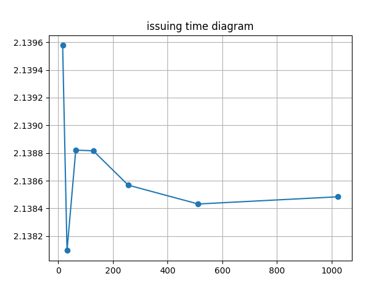

# FYP TTVS Backend Test

This is a Python app to test backend API for the final year project [FYP-Backend-remote](https://github.com/ttvs-blockchain/FYP-Backend-remote.git)

## Startup

To start the test, clone this repo, run the following code.

```{python}
pip3 install -r requirements.txt
```

## Test

This test takes at least 30 minutes. My machine has i3-9100F and 16 GB ram.

The database is deployed at a remote server. A better host machine with a local database may be faster.

Ask the host to provide IP. Modify IP_ADDRESS in ./testCreateAndUpload.py. Then run the following code.

```{python}
python3 testCreateAndUpload.py
```

testing for verification will be updated later


## Plot

Then modify the FOLDER_PATH in plot.py and run the following code.

```{python}
python3 plot.py
```

Then you can see the diagram in FOLDER_PATH.

## Sample

Sample result is below:

### Diagrams




### Table for experiments trial 2 on local backend

| no. of cetificates in series |  $2^4$   |  $2^5$   |  $2^6$   |   $2^7$   |   $2^8$   |   $2^9$   |  $2^{10}$  |
| :--------------------------: | :------: | :------: | :------: | :-------: | :-------: | :-------: | :--------: |
|         issuing time         | 2.139577 | 2.138096 | 2.138821 | 2.138816  | 2.138568  | 2.138432  |  2.138484  |
|         upload time          | 4.027577 | 5.845932 | 9.538707 | 16.862282 | 31.388436 | 60.442806 | 118.561657 |